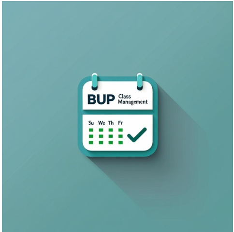

# 📚 Class Routine & Attendance Management System

<p align="center">
  
</p>

<p align="center">
  
  
  
  
  
</p>

---

## 🎓 Project Overview

The **Class Routine & Attendance Management System** is a **Java Swing–based desktop application** developed for academic use. It is designed to help **students, teachers, and section officers** efficiently manage **class routines, attendance records, and academic schedules** for the **BICE-2022 batch** at **Bangladesh University of Professionals (BUP)**.

The system provides **role-based access**, real-time database interaction, PDF generation of routines, and an intuitive graphical user interface.

---

## ✨ Key Features

### 👨‍🎓 Student Features

* Secure login and section detection (Section A / Section B)
* View class routine in table format
* Download routine as PDF
* View personal attendance records

### 👨‍🏫 Teacher Features

* Secure teacher login
* View complete class routine
* Take attendance for Section A & Section B
* Update attendance status instantly

### 🏢 Section Officer Features

* Manage and update class routines
* Edit routines directly from tables
* Manage Section A, Section B, and Teacher routines

---

## 🛠️ Technologies Used

| Category              | Technology            |
| --------------------- | --------------------- |
| Programming Language  | Java                  |
| GUI Framework         | Java Swing & AWT      |
| Database              | MySQL                 |
| Database Connectivity | JDBC                  |
| PDF Generation        | iText (or equivalent) |
| IDE                   | Eclipse / IntelliJ    |
| Version Control       | Git & GitHub          |

---

## 📂 Project Structure

```
Java_Project_2_1/
├── src/
│   └── javaProject/
│       ├── StudentLoginPage.java
│       ├── TeacherLoginGui.java
│       ├── SectionOfficerHome.java
│       ├── StudentPageA.java
│       ├── StudentPageB.java
│       ├── RoutineGui.java
│       ├── SectionAattGUI.java
│       ├── SectionBattGUI.java
│       ├── PDFGenerator.java
│       └── ...
├── Image/
│   └── UI images & icons
├── bin/
├── .project
├── .classpath
└── README.md
```

---

## 🔄 System Workflow

```
User Login
   ↓
Role Detection (Student / Teacher / Section Officer)
   ↓
Authorized Dashboard
   ↓
Routine / Attendance / PDF Operations
   ↓
MySQL Database
```

---

## 👥 Team Members

| Name                        | Role                                |
| --------------------------- | ----------------------------------- |
| **Umme Nafisa Anzum Kotha** | Student • Section Officer (Partial) |
| **Muttakin Mahmud**         | Teacher • Section Officer (Partial) |

---

## 🚀 How to Run the Project

1. Clone the repository

```bash
git clone https://github.com/yourusername/ClassRoutineApp.git
```

2. Open the project in **Eclipse / IntelliJ**

3. Configure **MySQL database**

* Create database: `routine`
* Import required tables (`routinea`, `routineb`, `teacherinfo`, `seca`, `secb`, etc.)

4. Update database credentials inside the source files

5. Run the main class (e.g., `Page2.java`)

---

## 📌 Project Status

✅ Completed (Academic Project)

---

## 🔮 Future Enhancements

* Web-based version (Spring Boot / React)
* Role-based authentication security improvements
* Dynamic date-based attendance
* Cloud database integration
* Notification system

---

## 📄 License

This project is developed for **academic purposes only**.

---

<p align="center">
  <b>Class Routine & Attendance Management System</b><br/>
  Built with ❤️ for Academic Excellence<br/>
  <i>Bangladesh University of Professionals – Department of ICT</i>
</p>
